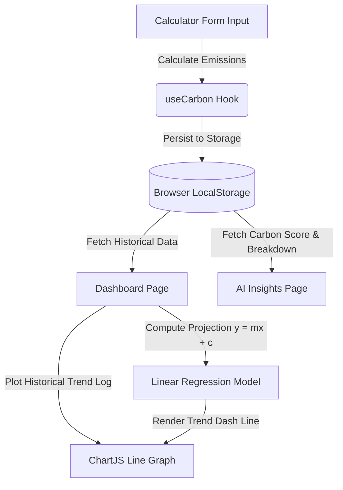

# Project Architecture Document

This document describes the architectural layout, core subsystems, data lifecycle flow, and design patterns used in **EcoTrack**.

## 🏗️ Folder Structure

The directory structure conforms to modern component-driven React conventions:

```text
ecotrack/
├── .github/workflows/   # CI/CD pipelines
│   └── ci.yml           # Runs linting, testing, and production builds
├── src/
│   ├── components/      # Common UI components (Navbar, Footer, ErrorBoundary, OnboardingModal)
│   ├── context/         # React Contexts (AuthContext for guest/user authentication, LanguageContext for localization)
│   ├── hooks/           # Custom React hooks (useCarbon for state/calculations, useLocalStorage for persistence)
│   ├── lib/             # Pure helper files, API integration, and calculations
│   │   ├── carbonCalculations.ts   # Core emission factors and scores
│   │   ├── constants.ts            # Fixed standards and average statistics
│   │   ├── geminiApi.ts            # Google Gemini Pro interface
│   │   ├── localStorage.ts         # Direct browser Storage APIs
│   │   └── trendAnalysis.ts        # Linear regression calculation engines
│   ├── pages/           # Page-level components routing layout
│   ├── test/            # Vitest custom configuration setup
│   ├── types/           # Core TypeScript types and definitions
│   ├── App.tsx          # Router config and core layout
│   ├── index.css        # Tailored CSS color system & theme adjustments
│   └── main.tsx         # Root engine entrypoint
```

---

## 🔄 Core Data Lifecycle

The state flow of EcoTrack is built to work without external backends (Privacy-First / Guest Mode):



1. **Emission Calculations**:
   - The user inputs details in [Calculator.tsx](file:///c:/Users/windows/OneDrive/Desktop/PROJ/ecotrack/src/pages/Calculator.tsx).
   - Validation ensures inputs are clean, non-negative, and non-empty.
   - [carbonCalculations.ts](file:///c:/Users/windows/OneDrive/Desktop/PROJ/ecotrack/src/lib/carbonCalculations.ts) evaluates emissions per category based on standard coefficients.
2. **Data Storage & History**:
   - Results are saved to `localStorage` under `ecotrack_footprints` via `useCarbon()`.
   - The list stores logs with timestamps to establish a historical progression.
3. **Visualization & Trend Projection**:
   - [Dashboard.tsx](file:///c:/Users/windows/OneDrive/Desktop/PROJ/ecotrack/src/pages/Dashboard.tsx) fetches the user's historical runs.
   - If historical runs exist, a linear regression trend line is calculated using the least squares method to project emissions for the next period.
   - The original trend and the projected trend line (dashed) are rendered using React-Chartjs-2.
4. **AI Recommendations**:
   - The [Insights.tsx](file:///c:/Users/windows/OneDrive/Desktop/PROJ/ecotrack/src/pages/Insights.tsx) page compiles categories, scores, and active user challenges, sending them to Google's Gemini Pro model to fetch custom reduction actions.

---

## 🌍 Localization Engine

- Managed globally via `LanguageProvider` ([LanguageContext.tsx](file:///c:/Users/windows/OneDrive/Desktop/PROJ/ecotrack/src/context/LanguageContext.tsx)).
- Supports dynamic English (`en`) and Hindi (`hi`) toggles.
- Language preferences are stored under the `ecotrack_locale` localStorage key.
- Translation dictionaries translate labels, inputs, alerts, step guides, and navigation items. Internal engineering values and API prompt templates remain in English for reliability.

---

## 🧩 Code Architecture Conventions

EcoTrack enforces a strict **hooks-based separation of concerns**. Every contributor must follow this contract:

### The Rule: Logic in Hooks, Rendering in Components

| Layer | Responsibility | Must NOT contain |
|---|---|---|
| **`/hooks`** | State, side-effects, business logic, data transformation | JSX, CSS classes, DOM references |
| **`/pages`** | Component composition, JSX rendering, event delegation | `useState` for non-UI state, `useEffect` for data fetching |
| **`/lib`** | Pure functions, calculations, API calls | React hooks, component state |
| **`/context`** | Global cross-cutting state (auth, language) | Business logic beyond their domain |

### Custom Hook Contract

Every custom hook in `/hooks` must:
1. **Export a named return type interface** (e.g., `UseCalculatorReturn`) — never rely on inferred return types.
2. **Have a JSDoc comment** with `@returns` describing the interface.
3. **Be named** with the `use` prefix and a domain noun (e.g., `useDashboardStats`, not `useDashboard`).
4. **Delegate persistence** to `useLocalStorage` or `useCarbon` — hooks must not call `localStorage` directly (except `useCarbon` and `useLocalStorage` themselves).

### Constants & Magic Values

All magic strings and numbers must live in [`src/lib/constants.ts`](file:///c:/Users/windows/OneDrive/Desktop/PROJ/ecotrack/src/lib/constants.ts):
- **Route paths** → `ROUTES`
- **Storage keys** → `STORAGE_KEYS`
- **Emission factors** → `EMISSION_FACTORS`
- **Score thresholds** → `SCORE_THRESHOLDS`
- **Color tokens** → `COLORS`
- **PDF sizing** → `PDF_CONFIG`

### Error Handling

All JSON parsing must go through [`safeJsonParse`](file:///c:/Users/windows/OneDrive/Desktop/PROJ/ecotrack/src/lib/errorHandling.ts) — never use bare `JSON.parse`. This ensures corrupted localStorage data degrades gracefully with a typed fallback instead of throwing at runtime.

